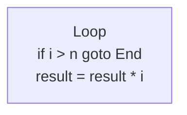

# C3D Playground - Arquitectura SOLID

Este proyecto implementa un playground para Código de 3 Direcciones (C3D) usando principios SOLID y Mermaid.js para visualización de grafos.

## 📁 Estructura del Proyecto

```
/
├── index.html          # Página principal con Bootstrap
├── style.css           # Estilos personalizados
└── src/
    ├── App.js          # Coordinador principal y manejo del DOM
    ├── Parser.js       # Parser de código C3D
    ├── Interpreter.js  # Intérprete de instrucciones
    ├── BlockBuilder.js # Constructor de bloques básicos
    └── GraphBuilder.js # Generador de código Mermaid
```

## 🎯 Principios SOLID Aplicados

### S - Single Responsibility Principle (Principio de Responsabilidad Única)

Cada clase tiene una única responsabilidad:

- **Parser.js**: Solo se encarga de parsear el código C3D y convertirlo en estructuras de datos.
- **Interpreter.js**: Solo ejecuta las instrucciones previamente parseadas.
- **BlockBuilder.js**: Solo construye los bloques básicos a partir de las instrucciones.
- **GraphBuilder.js**: Solo convierte bloques a sintaxis Mermaid.
- **App.js**: Solo coordina las interacciones del DOM y orquesta las otras clases.

### O - Open/Closed Principle (Principio Abierto/Cerrado)

El código está abierto a extensión pero cerrado a modificación:

- Se pueden agregar nuevos tipos de instrucciones en `Parser.js` sin modificar el código existente.
- Se pueden agregar nuevos operadores sin cambiar la lógica core del `Interpreter.js`.
- Se puede cambiar el formato de salida del grafo (de Mermaid a otro) extendiendo `GraphBuilder.js`.

### L - Liskov Substitution Principle (Principio de Sustitución de Liskov)

Las abstracciones son coherentes:

- Todas las clases mantienen contratos claros en sus métodos públicos.
- No se usa herencia innecesaria, solo composición.

### I - Interface Segregation Principle (Principio de Segregación de Interfaces)

No hay métodos innecesarios:

- Cada clase expone solo los métodos que realmente utiliza.
- No hay "god classes" con muchos métodos no relacionados.

### D - Dependency Inversion Principle (Principio de Inversión de Dependencias)

Las dependencias se inyectan:

- `Interpreter` recibe instrucciones y labels como parámetros, no los genera.
- `BlockBuilder` recibe instrucciones, no las parsea.
- `GraphBuilder` recibe bloques y edges, no los construye.
- `App.js` orquesta todas las dependencias creándolas y pasándolas explícitamente.

## 🔄 Flujo de Ejecución

```
1. Usuario escribe código C3D
2. App.js coordina:
   ├─> Parser.parse(code) → { instructions, labels }
   ├─> Interpreter.run() → { output, variables }
   ├─> BlockBuilder.build() → blocks
   ├─> BlockBuilder.getEdges() → edges
   └─> GraphBuilder.build() → mermaidCode
3. Mermaid renderiza el diagrama
```

## 🎨 Visualización con Mermaid

El grafo se genera usando **graph TD** (Top-Down) de Mermaid:

### Nodos
Cada bloque básico se representa como:


### Edges (Aristas)

- **Goto incondicional**: Flecha simple
  ```
  Block1 --> Block2
  ```

- **Goto condicional**: Dos flechas etiquetadas
  ```
  Block1 -->|true| TargetBlock
  Block1 -->|false| NextBlock
  ```

## 🚀 Uso

1. Abrir `index.html` en un navegador (requiere servidor estático)
2. Escribir código C3D o cargar ejemplo
3. Hacer clic en "Ejecutar"
4. Ver salida, variables y grafo generado

## 🔧 Tecnologías

- **HTML5 + CSS3**
- **JavaScript ES6+ (Módulos)**
- **Bootstrap 5** (UI/Layout)
- **Mermaid.js 10** (Visualización de grafos)

## 📝 Sintaxis C3D Soportada

### Etiquetas
```
Loop:
End:
```

### Operaciones
```
t1 = t2 + t3      // Suma
t1 = t2 - t3      // Resta
t1 = t2 * t3      // Multiplicación
t1 = t2 / t3      // División
t1 = t2 > t3      // Mayor que
t1 = t2 < t3      // Menor que
t1 = t2 >= t3     // Mayor o igual
t1 = t2 <= t3     // Menor o igual
t1 = t2 == t3     // Igual
t1 = t2 != t3     // Diferente
```

### Control de Flujo
```
goto Loop         // Salto incondicional
if t1 > 0 goto End  // Salto condicional
```

### Funciones Especiales
```
print t1          // Imprimir valor
end               // Fin del programa
```

## 🎓 Ejemplo Completo

```c3d
// Factorial de 5
n = 5
result = 1
i = 1

Loop:
if i > n goto End
result = result * i
i = i + 1
goto Loop

End:
print result
end
```

Este código genera:
- Bloques básicos: INICIO, Loop, End
- Edges: INICIO→Loop, Loop→End (true), Loop→Loop (reentry), End (terminal)

## 🔍 Extensibilidad

Para agregar nuevas características:

1. **Nuevo operador**: Agregar en `Parser.operators` y `Interpreter.applyOperator()`
2. **Nueva instrucción**: Agregar case en `Parser.parseLine()` e `Interpreter.executeInstruction()`
3. **Nuevo formato de grafo**: Extender `GraphBuilder` o crear nueva clase
4. **Nueva interfaz**: Modificar solo `App.js` sin tocar la lógica core

## 📄 Licencia

Proyecto educativo para el curso de Compiladores 2.
